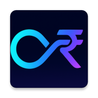
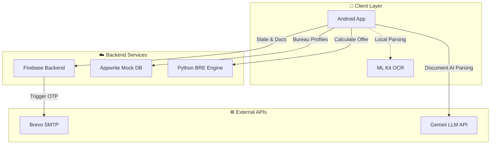
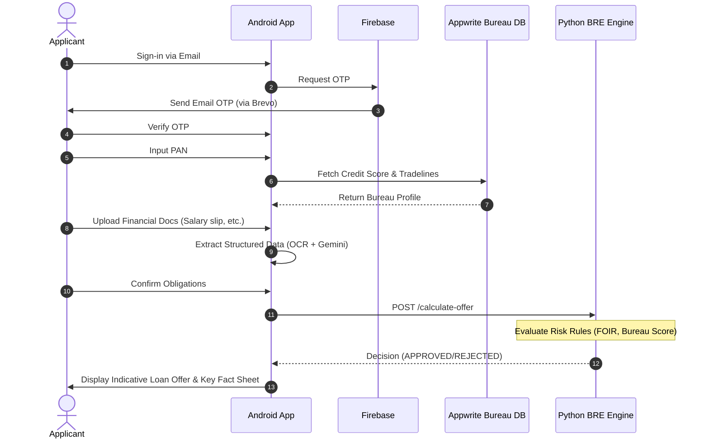

<div align="center">

#  LoansAI - Digital Loan Application & Decisioning Platform

[](https://kotlinlang.org/)
[](https://developer.android.com/compose)
[](https://www.python.org/)
[](https://firebase.google.com/)
[](https://appwrite.io/)
[](LICENSE)

An educational reference project demonstrating a modern, end-to-end digital lending journey.

[Key Features](#-key-features) • [Architecture](#%EF%B8%8F-system-architecture) • [Project Structure](#-project-structure) • [Getting Started](#-getting-started) • [Configuration](#-configuration)

</div>

---

## 📖 About The Project

LoansAI is a comprehensive showcase of a full, end-to-end digital lending ecosystem engineered from the ground up. This project goes far beyond a simple frontend application—it demonstrates the orchestration of a complete loan processing pipeline. The developer has integrated an online Business Rules Engine (BRE), external mock bureau databases connected via REST API services, a real-time cloud application data store for managing user applications, and sophisticated cloud-to-cloud processing to securely orchestrate verification workflows.

By bridging an advanced native mobile experience with a multi-layered backend, this platform handles the complete customer journey: from guided OTP-based onboarding and live AI-driven document extraction, to automated credit scoring lookups and instantaneous programmatic underwriting. This repository serves as a robust **learning sandbox** for developers exploring scalable mobile-to-backend architectures, cloud-native deployments, and the intersection of specialized AI with financial rule engines.

## ✨ Key Features

*   **🤖 Deep AI Integrations for Financial Workflows**:
    *   **Google Gemini LLM**: Utilized to intelligently parse unstructured financial text into standardized JSON schemas. It maps complex attributes from diverse bank statements, salary slips, and Income Tax Returns (ITR) into uniform data points required by the BRE.
    *   **ML Kit On-Device OCR**: Runs entirely locally on the mobile device to extract raw text blocks from camera captures and document uploads with ultra-low latency and privacy preservation before sending them to the LLM.
*   **📱 Native Android Application**: Built with modern Kotlin, Jetpack Compose, and Clean Architecture principles (MVVM, Usecases, Repositories), ensuring a fluid and reactive user experience.
*   **⚙️ Online Business Rules Engine (BRE)**: A dedicated Python Flask microservice acting as the underwriting brain. It performs programmatic core risk decisions, calculating Fixed Obligation to Income Ratios (FOIR), evaluating CIBIL scores against risk matrices, and determining final loan eligibilities, indicative rates, and maximum limits.
*   **📊 External Bureau Integration via API Services**: A fully-fledged mock Database setup using Appwrite. It provides API-driven services to simulate real-time credit bureau profiles, multi-account tradeline fetching, and hard-pull score lookups.
*   **☁️ Cloud Data & Cloud-to-Cloud Processing**: Firebase Firestore acts as the central real-time application data store, tightly coupled with Firebase Cloud Functions that execute secure server-to-server (cloud-to-cloud) interactions—such as triggering the external Brevo API for transactional OTP email verification and managing ephemeral application state data securely.

## 🏛️ System Architecture

The platform architecture is divided into three main layers: Client (Mobile), Backend Services, and External Communications.



<details>
<summary><b>Click to view the Application Onboarding & Decision Lifecycle</b></summary>



</details>

## 📁 Project Structure

```text
loansai/
├── apps/
│   └── mobile-android/         # Complete Native Kotlin Android Application
│       ├── app/src/main/java/com/loansai/unassisted/
│       │   ├── data/           # Repositories, Local DB (Room/DataStore), and API Clients (Retrofit)
│       │   ├── domain/         # Clean Architecture Use Cases and Business Logic Interfaces
│       │   ├── presentation/   # Jetpack Compose UI Screens, ViewModels, and Navigation
│       │   └── util/           # Constants, AI Integration Helpers, and Security Interceptors
│       └── build.gradle.kts    # App-level dependencies and build config
├── services/
│   ├── bre-python/             # Python Flask Underwriting Engine (Risk matrices, FOIR logic)
│   ├── appwrite-admin-tools/   # Node.js setups for mock bureau databases (Schemas, Data import scripts)
│   └── firebase-support/       # Cloud Functions (TypeScript) & Firestore database state utilities
├── docs/                       # Detailed setup and reference guides
│   ├── setup/                  
│   └── reference/              
└── AGENTS.md                   # AI Developer configuration & context rules
```

> [!NOTE]
> A legacy TypeScript reference file (`backend-llm-functions.ts`) remains in the Android project package tree for historical reference on Firebase Cloud Functions, but is ignored during the Android build process.

## 🚀 Getting Started

Follow these high-level steps to get the platform running locally. For detailed, component-specific instructions, see the respective guides in the `docs/setup` directory.

### Prerequisites
*   Android Studio (Latest Release Recommended)
*   Python 3.10+
*   Node.js v18+
*   Firebase Project & Appwrite Instance (Cloud or Self-Hosted)

### Step-by-Step Setup

1.  **Backend Services Initialization**: 
    *   Initialize Firebase ([Guide](./docs/setup/firebase-backend.md)).
    *   Configure Appwrite collections & import mock data ([Guide](./docs/setup/appwrite-admin-tools.md)).
    *   Start the Python BRE service locally ([Guide](./docs/setup/bre-python.md)).

2.  **Mobile App Compilation (Android Studio)**:
    *   Launch **Android Studio** and select *Open an existing project*.
    *   Navigate to and select the `loansai/apps/mobile-android` directory. Allow Gradle to sync dependencies.
    *   Create the required `keystore.properties` file in the root of the Android project (`apps/mobile-android/keystore.properties`) and populate it with your API keys (see Configuration section below).
    *   Place your Firebase `google-services.json` file inside `apps/mobile-android/app/`.
    *   Once Gradle sync is complete and errors resolve, select an Emulator (API 34+ recommended) or connect a physical device via ADB.
    *   Click the **Run 'app'** button (Shift + F10) or execute `./gradlew assembleDebug` in the terminal to compile and install the application onto the device.

## 🔑 Configuration

> [!WARNING]
> This codebase is tailored for public distribution. **Never commit local credential files, keystores, or `.env` files.** They are ignored via `.gitignore`.

### Android Environment (`apps/mobile-android/keystore.properties`)
Create this file to map external API keys:
```properties
openai_api_key=YOUR_OPENAI_API_KEY
gemini_api_key=YOUR_GEMINI_API_KEY
brevo_api_key=YOUR_BREVO_SMTP_API_KEY
# Optional release signing config
storePassword=YOUR_PASSWORD
keyAlias=YOUR_ALIAS
keyPassword=YOUR_ALIAS_PASSWORD
```

### Appwrite Environment (`services/appwrite-admin-tools/.env`)
```env
APPWRITE_ENDPOINT=https://cloud.appwrite.io/v1
APPWRITE_PROJECT_ID=your-project-id
APPWRITE_API_KEY=your-admin-api-key
APPWRITE_DATABASE_ID=your-database-id
```

## ⚠️ Security Notice

Before any production deployment or public demo, verify the following:
*   **No Hardcoded Secrets**: Ensure keys/passwords are kept in `.env` or keystore properties.
*   **Development Endpoints**: Be aware of endpoints currently hardcoded for development:
    *   Cloud Run Base APIs in `ApiConstants.kt`.
    *   BRE Endpoint in `NetworkModule.kt`.
    *   Appwrite Database IDs in `ApiConstants.kt` and `PANRepositoryImpl.kt`.

## 📄 License

This project is licensed under the MIT License - see the [LICENSE](LICENSE) file for details.
