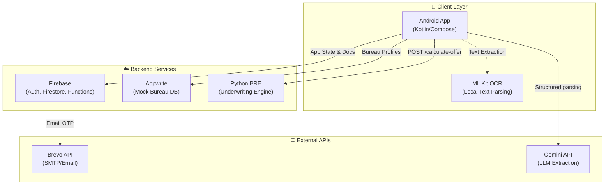
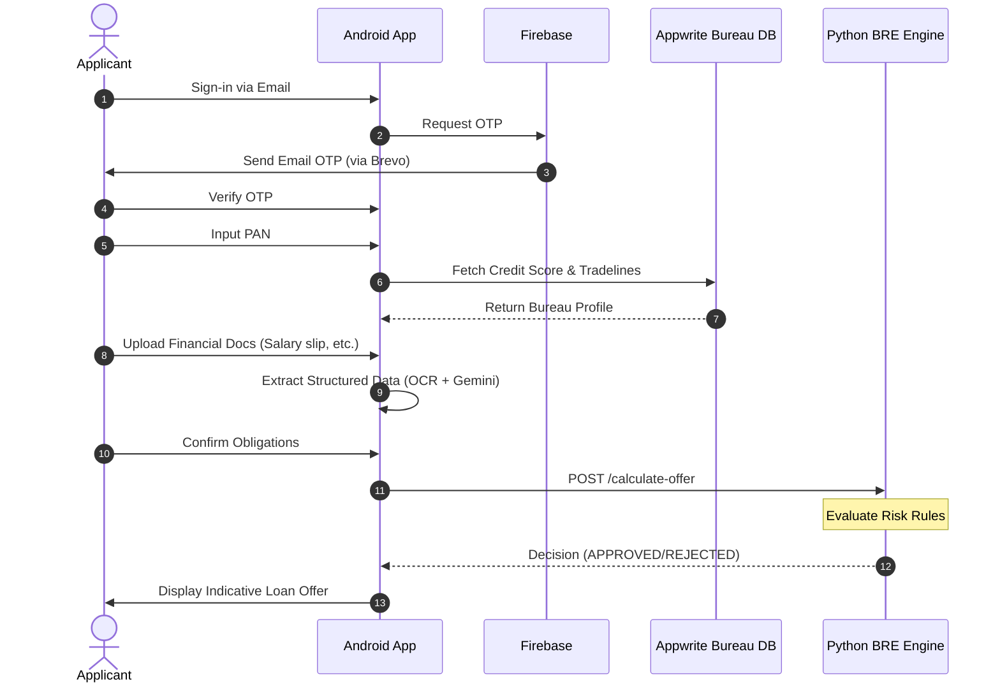

<div align="center">

# 🚀 LoansAI - Digital Loan Application & Decisioning Platform

[](https://kotlinlang.org/)
[](https://developer.android.com/compose)
[](https://www.python.org/)
[](https://firebase.google.com/)
[](https://appwrite.io/)
[](LICENSE)

An educational reference project demonstrating a modern, end-to-end digital lending journey.

[Key Features](#-key-features) • [Architecture](#%EF%B8%8F-system-architecture) • [Project Structure](#-project-structure) • [Getting Started](#-getting-started) • [Configuration](#-configuration)

</div>

---

## 📖 About The Project

LoansAI is a comprehensive showcase of a digital lending platform. It integrates guided user onboarding, automated PAN verification, simulated bureau credit-score lookups, on-device OCR, AI-assisted financial document extraction, a rule-based Business Rules Engine (BRE), and OTP-based email workflows.

This repository serves as a **learning sandbox** for developers exploring mobile-to-backend architectures, rule engines, document classification, and AI/LLM structured text extraction within a financial context.

## ✨ Key Features

*   **📱 Native Android App**: Built with modern Kotlin, Jetpack Compose, and Clean Architecture principles (MVVM, Usecases, Repositories).
*   **🤖 AI-Powered Document Processing**: Leverages Google's Gemini API and ML Kit OCR for on-device extraction of structured data from Salary Slips, Bank Statements, and ITRs.
*   **⚙️ Business Rules Engine (BRE)**: A Python Flask microservice that performs core underwriting decisions based on FOIR, CIBIL scores, and income calculations.
*   **📊 Bureau Integration Simulation**: Appwrite-based mock databases to simulate credit bureau profiles, tradelines, and score lookups.
*   **🔐 Secure Onboarding**: OTP-based email authentication workflows orchestrated via Firebase and Brevo API.

## 🏛️ System Architecture

The platform architecture is divided into three main layers: Client (Mobile), Backend Services, and External Communications.



<details>
<summary><b>Click to view the Application Onboarding & Decision Lifecycle</b></summary>



</details>

## 📁 Project Structure

```text
loansai/
├── apps/
│   └── mobile-android/         # Kotlin Android Application
├── services/
│   ├── bre-python/             # Python Flask Underwriting Engine
│   ├── appwrite-admin-tools/   # Node.js setups for mock bureau databases
│   └── firebase-support/       # Cloud Functions & Firestore utilities
├── docs/                       # Detailed setup and reference guides
│   ├── setup/                  
│   └── reference/              
└── AGENTS.md                   # AI Developer configuration & context rules
```

> [!NOTE]
> A legacy TypeScript reference file (`backend-llm-functions.ts`) remains in the Android project package tree for historical reference on Firebase Cloud Functions, but is ignored during the Android build process.

## 🚀 Getting Started

Follow these high-level steps to get the platform running locally. For detailed, component-specific instructions, see the respective guides in the `docs/setup` directory.

### Prerequisites
*   Android Studio (Latest)
*   Python 3.10+
*   Node.js v18+
*   Firebase Project & Appwrite Instance (Cloud or Self-Hosted)

### Step-by-Step Setup

1.  **Backend Services**: 
    *   Initialize Firebase ([Guide](./docs/setup/firebase-backend.md)).
    *   Configure Appwrite collections & import mock data ([Guide](./docs/setup/appwrite-admin-tools.md)).
    *   Start the Python BRE service locally ([Guide](./docs/setup/bre-python.md)).
2.  **Mobile App**:
    *   Open `apps/mobile-android` in Android Studio.
    *   Configure `keystore.properties` (see below) and add `google-services.json`.
    *   Build and run on an emulator or physical device ([Guide](./docs/setup/build-and-install.md)).

## 🔑 Configuration

> [!WARNING]
> This codebase is tailored for public distribution. **Never commit local credential files, keystores, or `.env` files.** They are ignored via `.gitignore`.

### Android Environment (`apps/mobile-android/keystore.properties`)
Create this file to map external API keys:
```properties
openai_api_key=YOUR_OPENAI_API_KEY
gemini_api_key=YOUR_GEMINI_API_KEY
brevo_api_key=YOUR_BREVO_SMTP_API_KEY
# Optional release signing config
storePassword=YOUR_PASSWORD
keyAlias=YOUR_ALIAS
keyPassword=YOUR_ALIAS_PASSWORD
```

### Appwrite Environment (`services/appwrite-admin-tools/.env`)
```env
APPWRITE_ENDPOINT=https://cloud.appwrite.io/v1
APPWRITE_PROJECT_ID=your-project-id
APPWRITE_API_KEY=your-admin-api-key
APPWRITE_DATABASE_ID=your-database-id
```

## ⚠️ Security Notice

Before any production deployment or public demo, verify the following:
*   **No Hardcoded Secrets**: Ensure keys/passwords are kept in `.env` or keystore properties.
*   **Development Endpoints**: Be aware of endpoints currently hardcoded for development:
    *   Cloud Run Base APIs in `ApiConstants.kt`.
    *   BRE Endpoint in `NetworkModule.kt`.
    *   Appwrite Database IDs in `ApiConstants.kt` and `PANRepositoryImpl.kt`.

## 📄 License

This project is licensed under the MIT License - see the [LICENSE](LICENSE) file for details.
