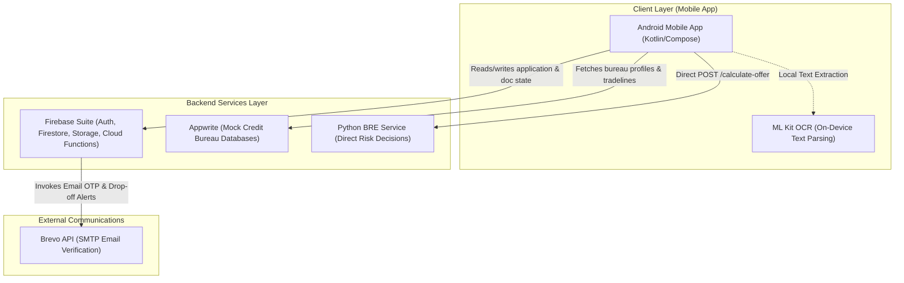
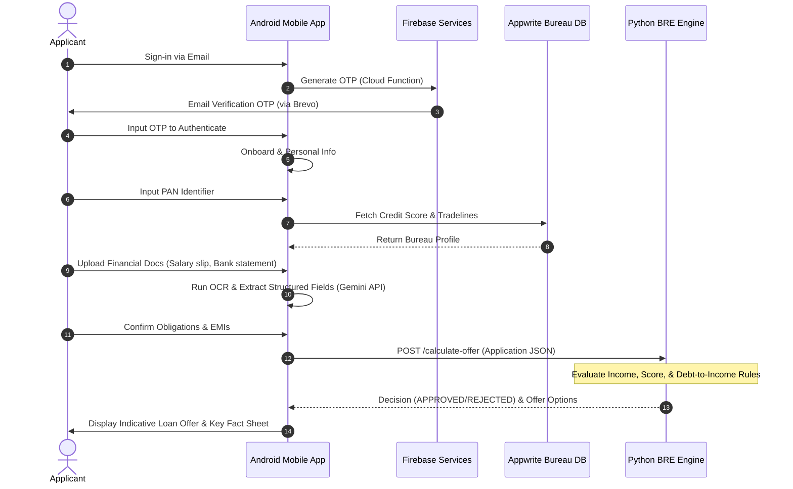

# 🚀 AI-Enabled Digital Loan Application & Decisioning Platform

[](https://kotlinlang.org/)
[](https://developer.android.com/compose)
[](https://www.python.org/)
[](https://firebase.google.com/)
[](https://appwrite.io/)
[](LICENSE)

An educational reference project demonstrating a modern, end-to-end digital lending journey. It integrates guided user onboarding, automated PAN verification, bureau credit-score lookup, on-device OCR, AI-assisted financial document extraction, a rule-based Business Rules Engine (BRE), and OTP-based email workflows.

This repository serves as a learning sandbox for developers exploring mobile-to-backend designs, rule engines, document classification, and AI/LLM structured text extraction inside a financial context.

---

## 🏛️ System Architecture & Workflow

The platform consists of a native Android application interacting with specialized cloud and backend systems to orchestrate the loan lifecycle:



### 🔁 Application Onboarding & Decision Lifecycle



---

## 📁 Repository Directory Structure

```text
loansai-root/
│
├── apps/
│   └── mobile-android/         # Kotlin Android Application (Jetpack Compose, Hilt, Retrofit)
│
├── services/
│   ├── bre-python/             # Flask Rule Engine Service (python-based rule evaluator)
│   ├── appwrite-admin-tools/   # Node.js setups and script loaders for bureau credit profiles
│   └── firebase-support/       # Cloud Functions (ver 4) & Firebase Firestore clean-up tools
│
├── docs/                       # Configuration, Migration details & Setup guides
│   ├── setup/                  # Step-by-step developer setup guides
│   ├── migration/              # Repository cleanup baseline and rules audit
│   └── reference/              # Historical architecture guides and API catalogs
│
├── AGENTS.md                   # AI Developer configuration, active codebase limits & context rules
└── README.md                   # Root Documentation (this file)
```

> [!NOTE]
> There is a TS reference file [backend-llm-functions.ts](file:///media/Adata_Data/Loan_App_Project/git_repo/apps/mobile-android/app/src/main/java/com/loansai/unassisted/backend-llm-functions.ts) located inside the Android project package tree. This serves as historical reference code for Firebase Cloud Functions and does not affect compiler packaging as the Gradle Kotlin build ignores TypeScript.

---

## 💻 Component Summary

### 📱 1. Mobile Android App (`apps/mobile-android`)
A modern Jetpack Compose application following Clean Architecture principles (MVVM, Usecases, Repositories).
*   **Networking**: Retrofit & OkHttp interface with Firebase Cloud Run backend APIs.
*   **Local Storage**: DataStore Preferences for user caching and session variables.
*   **Security**: Integrates Play Services Integrity and standard Auth Interceptors.
*   **AI Integrations**: Uses Gemini Android SDK directly to analyze OCR text from uploaded documents (Salary slips, Bank statements, ITR) and map them to structured JSON payloads.

### 🐍 2. Python BRE Service (`services/bre-python`)
A lightweight Python Flask microservice serving as the core underwriting decision engine.
*   Determines application eligibility using metrics like FOIR (Fixed Obligation to Income Ratio) and CIBIL score.
*   Outputs standard underwriting outcomes (`AUTO_APPROVED`, `REJECTED`, or `REFER_TO_UNDERWRITER`).
*   Calculates indicative credit limits, pricing, and maximum eligible tenures.

### ⚖️ 3. Appwrite Admin Tools (`services/appwrite-admin-tools`)
Admin scripts used to pre-provision mock bureau and credit scoring collections in an Appwrite Database.
*   [setup-appwrite-collections.js](file:///media/Adata_Data/Loan_App_Project/git_repo/services/appwrite-admin-tools/setup-appwrite-collections.js) automatically sets up collections for `borrower_summary`, `enquiries`, and `tradelines` with proper attributes and keys.
*   [upload-report.js](file:///media/Adata_Data/Loan_App_Project/git_repo/services/appwrite-admin-tools/upload-report.js) uploads normalized mock borrower data (such as [geeta_cibil_report.json](file:///media/Adata_Data/Loan_App_Project/git_repo/services/appwrite-admin-tools/geeta_cibil_report.json)).

### 🔥 4. Firebase Backend Support (`services/firebase-support`)
Firebase Functions and helper tools written in TypeScript to manage backend workflow operations.
*   Orchestrates OTP generation, expiration timelines, and verification checks.
*   Sends transactional system emails (SMTP) through Brevo API integration.
*   Includes developer scripts to download or flush Firestore databases during debugging.

---

## 🛠️ Installation & Setup Guides

To run the complete workflow, refer to these detailed setup manuals in order:

1.  **[Firebase Backend Setup](./docs/setup/firebase-backend.md)**: Initialize your Firestore, Storage, and Cloud Functions configurations.
2.  **[Appwrite Database Setup](./docs/setup/appwrite-admin-tools.md)**: Configure API keys, spin up collections, and import mock CIBIL reports.
3.  **[BRE python Service Setup](./docs/setup/bre-python.md)**: Run the python underwriting service locally or containerize via Docker.
4.  **[Email Integration Guide](./docs/setup/email-verification.md)**: Connect Brevo SMTP details for OTP capabilities.
5.  **[Android Application Setup](./docs/setup/mobile-android.md)**: Import the client codebase, link Gradle dependencies, and configure compile variables.
6.  **[APK Build & Install Guide](./docs/setup/build-and-install.md)**: Compile the application and test on emulator/physical device.

---

## 🔑 Configuration & Safe Secrets Setup

Because this codebase is tailored for public distribution, **all local credential files, keystores, and private settings are excluded from Git** (managed via `.gitignore`). You must manually configure these values for local development.

### 1. Android Configurations
Create a `keystore.properties` file in `apps/mobile-android/keystore.properties` to map external API keys:
```properties
# apps/mobile-android/keystore.properties
openai_api_key=YOUR_OPENAI_API_KEY
gemini_api_key=YOUR_GEMINI_API_KEY
brevo_api_key=YOUR_BREVO_SMTP_API_KEY

# Optional release signing configs
storePassword=YOUR_KEYSTORE_PASSWORD
keyAlias=YOUR_ALIAS
keyPassword=YOUR_ALIAS_PASSWORD
```
Download and place your Firebase `google-services.json` at:
```text
apps/mobile-android/app/google-services.json
```

### 2. Service Configurations
Configure a local `.env` file for Appwrite admin tools:
```env
# services/appwrite-admin-tools/.env
APPWRITE_ENDPOINT=https://cloud.appwrite.io/v1
APPWRITE_PROJECT_ID=your-project-id
APPWRITE_API_KEY=your-admin-api-key
APPWRITE_DATABASE_ID=your-database-id
```

---

## ⚠️ Security Notice & Publishing Checklist

Before executing a production deployment, demo, or public release, ensure you review the following publish items:

*   **API Credentials**: Never commit keystores, `.env` files, or service account JSON credentials to version control.
*   **Infrastructure Endpoints**: Review hardcoded endpoints inside the development baseline:
    *   **Cloud Run Base APIs**: Set in [ApiConstants.kt](file:///media/Adata_Data/Loan_App_Project/git_repo/apps/mobile-android/app/src/main/java/com/loansai/unassisted/util/constants/ApiConstants.kt#L9-L14)
    *   **Direct BRE Endpoint**: Defined in [NetworkModule.kt](file:///media/Adata_Data/Loan_App_Project/git_repo/apps/mobile-android/app/src/main/java/com/loansai/unassisted/data/local/database/di/NetworkModule.kt#L288)
    *   **Appwrite Database ID**: Defined in [ApiConstants.kt](file:///media/Adata_Data/Loan_App_Project/git_repo/apps/mobile-android/app/src/main/java/com/loansai/unassisted/util/constants/ApiConstants.kt#L62) and [PANRepositoryImpl.kt](file:///media/Adata_Data/Loan_App_Project/git_repo/apps/mobile-android/app/src/main/java/com/loansai/unassisted/data/repository/PANRepositoryImpl.kt#L79)
*   **Camunda Code**: Active flows do not depend on Camunda orchestrations. Dormant classes are retained purely as reference layout.

---

## 📄 License
This project is released under the **MIT License**. Check out `LICENSE` for further details.
